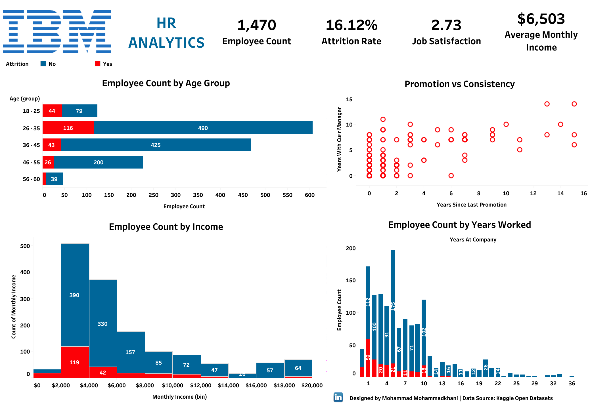

# Why are they leaving?

IBM is an American multinational technology corporation headquartered in Armonk, New York, with operations in over 171 countries. The HR director has recently noticed an increase in employees leaving (attrition). She would like to figure out any trends or patterns. This is a fictional data set created by IBM data scientists. She would like to know what the attrition rate is. She would also like to know if factors like age, income, experience, continuity, and promotions play a part in determining if people will leave or not.
* Created a KPI Report in Tableau providing precise insights on attrition rate as a measure and potential influencing factors like age, income, experience, and continuity.
* Generated headline cards to outline general performance indicators.
* Identified noticeable clusters inspecting two factors management continuity and personal promotion history.

Dashboard is available on [Tableau Public](https://public.tableau.com/app/profile/mo.with.data/viz/IBMHRAnalytics_16451331222160/Dashboard)

